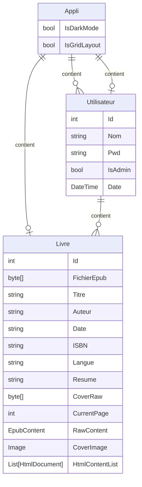

# EEEEReader

## Electronic Edition Engine Enhanced Reader

### Import de livres

* Importation fichiers EPUB
* Extraction automatique du titre, de l’auteur et de la couverture (si disponibles)

### Bibliothèque

* Affichage en vignettes ou en liste
* Tri par titre, auteur ou récents
* * Thèmes clair, sombre

### Lecteur (affichage continu)
* Une page par chapitre
* Affichage des images 
* Reprise automatique à la dernière position de lecture

## Diagramme SQL
Note: utilise [Crow's Foot Notation](https://www.freecodecamp.org/news/crows-foot-notation-relationship-symbols-and-how-to-read-diagrams/)

