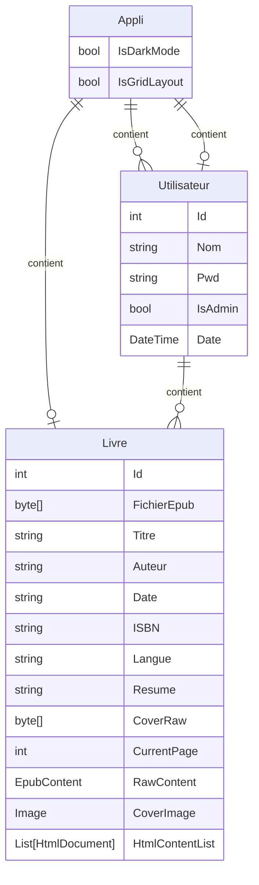

```mermaid

erDiagram
	direction TB
	Utilisateur {
		int Id  ""  
		string Nom  ""  
        	string Pwd "" 
		bool IsAdmin  ""  
		DateTime Date  ""  
	}

	Livre {
		int Id  ""  
		byte[] FichierEpub  ""  
		string Titre  ""  
		string Auteur  ""  
		string Date  ""  
		string ISBN  ""  
		string Langue  ""  
		string Resume  ""  
		byte[] CoverRaw  ""  
        	int CurrentPage ""
        	EpubContent RawContent  "" 
        	Image CoverImage ""
        	List[HtmlDocument] HtmlContentList ""
	}

    	Appli {
        	bool IsDarkMode ""
        	bool IsGridLayout ""
    	}

	Appli ||--o{ Utilisateur : contient
    	Appli ||--|o Utilisateur : contient
   	Appli ||--|o Livre : contient
    	Utilisateur ||--o{ Livre : contient

```
